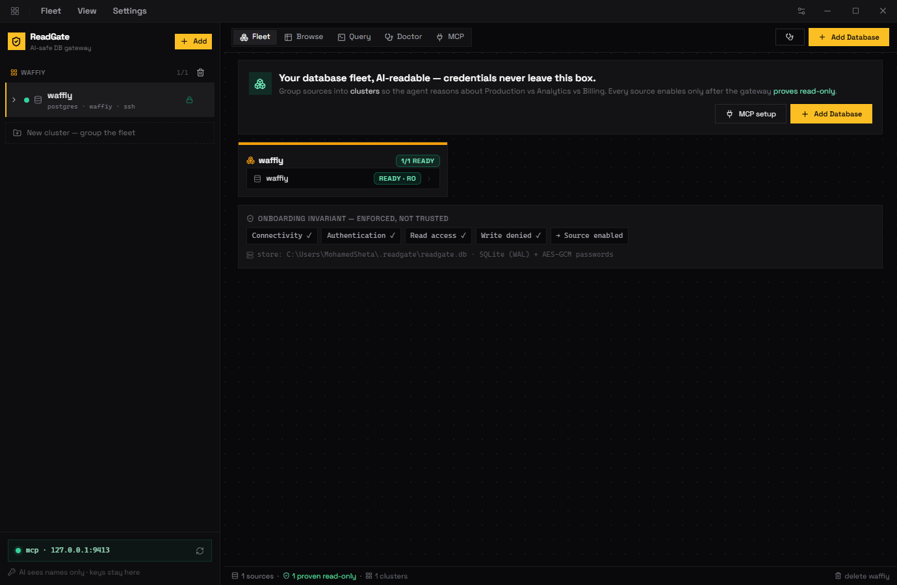

# ReadGate

[](https://github.com/iMohamedSheta/ReadGate/actions/workflows/ci.yml)
[](https://github.com/iMohamedSheta/ReadGate/releases/latest)

One `ReadGate.exe`, no installer, no DLLs. Your database fleet, AI-readable —
credentials never leave this box.

```
AI ──MCP──▶ Gateway ──SSH tunnel──▶ Server ──localhost──▶ Database
```

A source enables **only after the gateway proves the identity is read-only**
(connectivity ✓, authentication ✓, read access ✓, write denied ✓).



## Download

1. Open the [**latest release**](https://github.com/iMohamedSheta/ReadGate/releases/latest)
2. Under **Assets**, download **`ReadGate.exe`** (single file, no installer, no DLLs)
3. Double-click `ReadGate.exe` — data lives in `%USERPROFILE%\.readgate\readgate.db`
4. If Windows SmartScreen warns (the exe is unsigned): **More info → Run anyway**

`ReadGate.exe --version` prints the embedded release tag (`dev` for local builds;
Settings → AI access shows it too).

## Contents

- [Engines](#engines)
- [Onboarding](#onboarding)
- [Browse, Query, Doctor](#browse-query-doctor)
- [Table editing (app writes)](#table-editing-app-writes)
- [MCP — let the AI read your fleet](#mcp--let-the-ai-read-your-fleet)
- [Data, troubleshooting](#data-troubleshooting)
- [Build from source](#build-from-source)
- [Releasing](#releasing)
- [Project layout](#project-layout)

## Engines

Group sources into **clusters** (Production, Analytics, Billing…) so the agent
reasons about the right database. Same workflow for every engine; only the
login details differ.

| Engine | Status | Notes |
|---|---|---|
| PostgreSQL | ✅ Ready | Full proof + auto-provision of `ai_readonly` |
| MySQL / MariaDB / TiDB | ✅ Ready | `CREATE USER` + `SELECT, SHOW VIEW` grants, `SHOW GRANTS` audit |
| SQLite | ✅ Ready | Local `.db` file — no server, no login, always opened read-only |
| Turso | ✅ Ready | `libsql://` URL + token; gateway-enforced read-only (tokens are full-access) |
| SQL Server | ✅ Ready | `db_datareader`-only proof, `TOP`/`OFFSET-FETCH` paging, `SHOWPLAN_ALL` |
| CockroachDB / Redshift | 🧪 Beta | Postgres wire — best effort |
| ClickHouse | ⏳ Soon | Needs driver + dialect |
| Oracle | 📋 Planned | Needs Oracle client libraries |

Connection modes: **SSH tunnel** (Postgres/MySQL/SQL Server families),
**direct** host:port, **file** (SQLite), **URL + token** (Turso).

## Onboarding

Add Database → pick engine → connect → temporary admin credentials
(**never stored**) → gateway creates the dedicated read-only identity →
proves `SELECT ✓ / write denied ✓ / read-only ✓` → source enables → live on MCP.

Manual mode: the gateway generates the SQL script, you run it as admin, and
only the read-only username + password come back.

## Browse, Query, Doctor

- **Browse** — Beekeeper-style table list with row estimates, filter builder
  (`contains, =, ≠, >, starts with, IN, is null…`) + raw `WHERE` mode, paging,
  CSV export, per-column filters, sortable columns, click-a-row detail view.
- **Query** — guarded editor (`SELECT / WITH / EXPLAIN / SHOW` only, no stacked
  statements, auto-`LIMIT`, 500-row cap, 15s timeout) with tabs + history, runs
  as the read-only identity in a `READ ONLY` transaction.
- **Doctor** — the same health probes the AI uses: seq scans, missing PKs,
  connection pressure, long queries, biggest tables.

## Table editing (app writes)

The app is read-only by default. Flip **Settings → General → Allow
modifications**, and Browse grows an **Edit rows** mode: edit cells, add rows,
delete rows, then **Apply** — every batch shows its exact SQL and asks first.

- Row DML only (`INSERT / UPDATE / DELETE`) — DDL is blocked, full-table
  `UPDATE`/`DELETE` needs explicit confirmation.
- Server databases need a saved **write login** (`postgres`, `root`, `sa`…),
  AES-GCM encrypted in SQLite, used only for live edit connections.
- SQLite needs no login; Turso reuses its token.
- **The AI stays read-only**: no MCP tool can write, ever.

## MCP — let the AI read your fleet

The same exe is an **MCP server** (protocol 2024-11-05): `ReadGate.exe mcp`
speaks stdio, so opencode launches it directly — no window, no port. The AI
sees **names only** (clusters, sources, tables, columns) — never hosts, ports,
users, or passwords. The MCP tab has per-client setup guides (opencode first),
a 14-tool reference with examples, the recommended workflow, and a self-test.

| Tool | What it does |
|---|---|---|
| `fleet_overview` | Clusters + source names — the AI starts here |
| `list_sources` / `list_clusters` | Enabled sources / cluster list |
| `search_tables` | Fuzzy-find tables by name fragment |
| `schema` / `table_stats` | Table inventory / sizes, scans, bloat |
| `columns` / `indexes` / `relationships` | Shape, indexes, FK graph for JOINs |
| `query` / `sample` | Guarded SELECT (500-row cap, 15s timeout) / first N rows |
| `explain` / `slow_queries` | Plan JSON / heaviest statements |
| `doctor` | Seq scans, missing PKs, pressure, long queries |

## Data, troubleshooting

- Store: `%USERPROFILE%\.readgate\readgate.db` (SQLite WAL) + `key.bin` (`0600`).
  Override the folder with `READGATE_HOME` (also used to run an isolated copy).
- Passwords are AES-GCM encrypted; backend errors (never secrets) land in
  Settings → Logs — reproduce the error, hit reload, paste the red lines.
- If the app ever shows a blank page: end **every** `ReadGate.exe` in Task
  Manager, then launch fresh.

## Build from source

```bash
go mod tidy
wails build -platform windows/amd64 -o ReadGate.exe   # single file in build/bin
wails dev            # desktop + hot reload
cd frontend && npm install && npm run dev   # frontend only
```

`ReadGate.exe mcp` runs the MCP server on stdio (used by opencode `type: local`).

## Releasing

Every push to `main` publishes a new GitHub Release automatically
(`.github/workflows/release.yml`), same system as goals: the exe is built with
Wails with the version baked in
(`-ldflags "-X readgate/internal/version.Version=v…"`), screenshotted while
running, and uploaded as `ReadGate.exe` + `screenshot.png`.

The version bump follows [Conventional Commits](https://www.conventionalcommits.org/):

| Commit message | Bump |
|---|---|
| `feat: ...` / `feat(scope): ...` | minor (`x.Y.0`) |
| `fix: ...` / `fix(scope): ...` | patch (`x.y.Z`) |
| `...!:` / `BREAKING CHANGE` in body | major (`X.0.0`) |
| anything else (`docs:`, `chore:`, …) | patch |

Add `[skip release]` to the HEAD commit message to skip publishing.
Pushes that don't touch the shipped app (docs, `docs/`, `.github/`, `scripts/`)
are skipped automatically — they batch up into the next app release instead.
Pull requests and pushes run `CI` instead: `go build`, `go test`, `go vet`,
`staticcheck` (bug detection) plus `staticcheck -checks "all"` (style lint),
and the frontend `vite build`.

Refresh the docs screenshot any time (uses your live profile, window only):

```powershell
./scripts/screenshot.ps1 -OutFile "docs/screenshot.png"
```

## Project layout

```
ReadGate/
  main.go / app.go            # Wails entry, backend bindings (fleet, browse, MCP, writes)
  internal/
    pg/ my/ mssql/            # server engines (Postgres / MySQL / SQL Server families)
    lite/ turso/              # SQLite file / Turso libsql
    dbops/ engines/           # engine dispatcher + registry (ports, status)
    guard/                    # read-only + write SQL validation
    store/                    # SQLite + AES-GCM secrets + settings + write logins
    mcpserver/                # MCP over stdio + HTTP (14 tools, names only)
    version/                  # release tag baked via ldflags
  frontend/src/               # React UI (fleet, browse, query, doctor, MCP, settings)
  scripts/                    # next-version.ps1, screenshot.ps1
  docs/screenshot.png         # app screenshot (README + releases)
```
